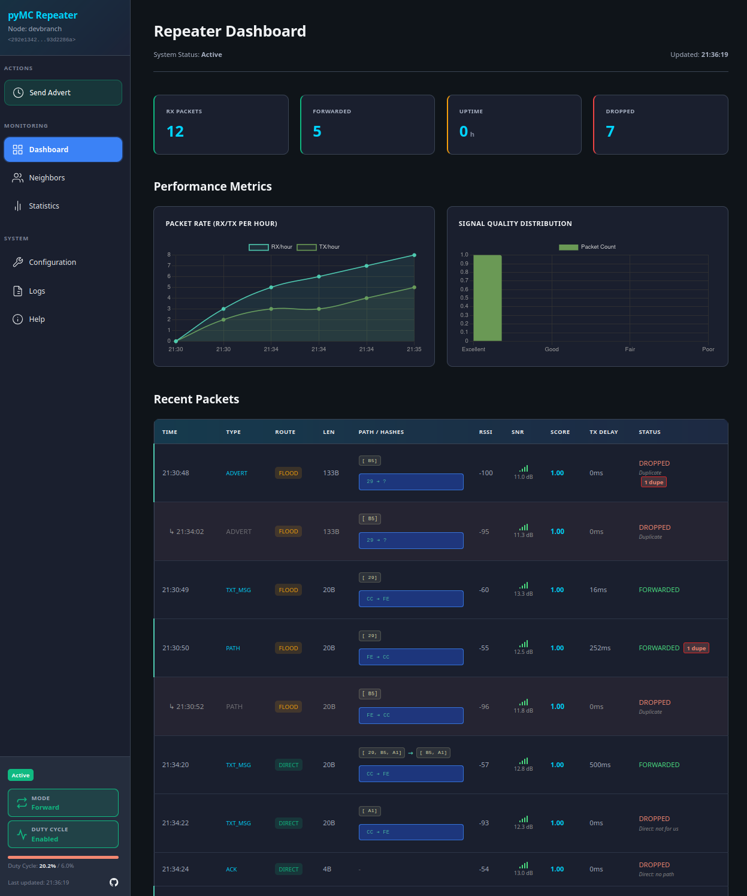
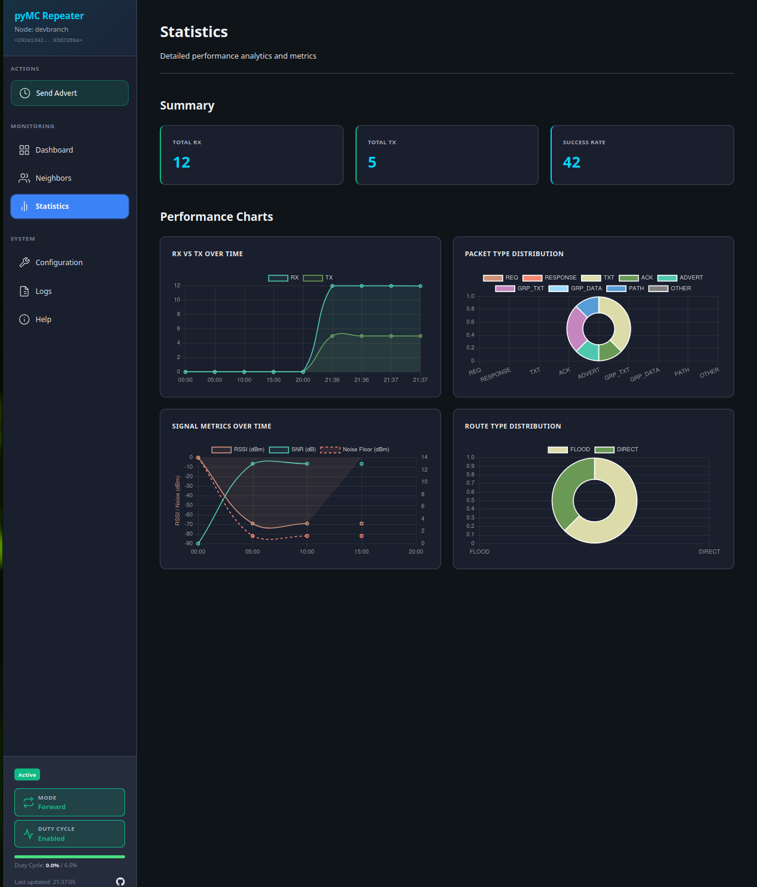

# openHop Repeater

Lightweight Python MeshCore repeater daemon built on `openhop_core`.

Formerly `pyMC_Repeater` built on `pyMC_core`.

openHop Repeater is designed to run continuously on low-power Linux hardware such
as Raspberry Pi-class devices, Proxmox LXC containers, and network-attached
radio modems. It forwards LoRa packets, exposes a web dashboard, and provides
configuration tools for radio setup, policy management, monitoring, and
integrations.

## Contents

- [Overview](https://docs.openhop.dev/projects/openhop-repeater/what-is-openhop-repeater/)
- [Screenshots and dashboard](https://docs.openhop.dev/projects/openhop-repeater/web-dashboard/)
- [Supported Hardware](https://docs.openhop.dev/projects/openhop-repeater/hardware-setup/)
- [Installation](https://docs.openhop.dev/projects/openhop-repeater/installation/)
- [Configuration](https://docs.openhop.dev/projects/openhop-repeater/config-file/)
- [Policy Engine](https://docs.openhop.dev/projects/openhop-repeater/web-dashboard/)
- [Upgrading](https://docs.openhop.dev/projects/openhop-repeater/installation/#upgrading-an-older-pymc-installation)
- [Proxmox LXC Installation](https://docs.openhop.dev/projects/openhop-repeater/installation/#proxmox-lxc-with-ch341)
- [Uninstallation](https://docs.openhop.dev/projects/openhop-repeater/uninstallation/)
- [Docker Compose](https://docs.openhop.dev/projects/openhop-repeater/docker/)
- [Roadmap](#roadmap)
- [Contributing](https://docs.openhop.dev/projects/openhop-repeater/development/)
- [Support](#support)
- [Disclaimer](#disclaimer)
- [License](#license)

## Overview

The repeater daemon runs as a background service and forwards LoRa packets using
the `openhop_core` dispatcher and routing stack. The project favors a simple,
hackable architecture:

- CherryPy provides a lightweight HTTP server for the web UI and API.
- The web interface supports setup, monitoring, logs, configuration, and updates.
- Packet routing, policy checks, storage, sensors, GPS, MQTT, and optional
  pyMC_Glass integration are kept in modular components.
- Hardware support covers direct SPI radios, CH341 USB-to-SPI adapters,
  openHop TCP/USB modem firmware, and KISS serial modems.

Real-world deployment feedback is especially welcome. Dense networks, unusual
hardware, and production-style installations are the best way to find the rough
edges and make the repeater better for everyone.

## Screenshots

### Dashboard



Real-time packet statistics, neighbor discovery, and system status.

### Statistics



Historical statistics and performance metrics.

## Supported Hardware

openHop Repeater supports these radio backends:

- **SX1262 over Linux SPI**: set `radio_type: sx1262`
- **SX1262 over CH341 USB-to-SPI**: set `radio_type: sx1262_ch341`
- **openHop Modem over Wi-Fi/Ethernet**: set `radio_type: modem_tcp`
- **openHop Modem over USB-CDC**: set `radio_type: modem_usb`
- **KISS serial modem**: set `radio_type: kiss`
- **No radio hardware**: set `radio_type: null` for setup, testing, or API-only work

> [!CAUTION]
> **Compatibility**
>
> This project targets single-radio SX1262-class transceivers and supported
> modem integrations. It does not support UART-only HATs or SX1302/SX1303
> concentrator boards.

| Interface | Status |
|-----------|--------|
| Native SX1262 SPI radio | Supported |
| CH341 USB-to-SPI bridge | Supported |
| openHop TCP modem | Supported |
| openHop USB-CDC modem | Supported |
| KISS serial modem | Supported |
| UART-only HATs | Not supported |
| SX1302/SX1303 concentrator boards | Not supported |

The following devices have out-of-the-box presets or known support:

| Device Name | Platform | TX Power | Connection | Radio Module | Link |
|-------------|----------|----------|:----------:|:------------:|------|
| HackerGadgets uConsole | uConsole / Raspberry Pi CM | Up to 22 dBm | SPI | SX1262-class | [View](https://www.clockworkpi.com/home-uconsole) |
| Zindello Industries UltraPeater | Luckfox | Up to 30 dBm | SPI | E22, E22P | [View](https://zindello.com.au/ultrapeater/) |
| MeshSmith PiMesh-1W | Raspberry Pi | Up to 30 dBm | SPI | E22P | [View](https://meshsmith.net/products/pimesh-1w) |
| MeshSmith EtherMesh-1W | Network | Up to 30 dBm | TCP | E22P | [View](https://meshsmith.net/products/ethermesh-1w) |
| Frequency Labs meshadv-mini | Raspberry Pi | Up to 30 dBm | SPI | E22 | [View](https://www.etsy.com/shop/FrequencyLabs) |
| Frequency Labs meshadv | Raspberry Pi | Up to 30 dBm | SPI | E22 | [View](https://www.etsy.com/shop/FrequencyLabs) |

Always confirm pin mappings, antenna setup, regional frequency rules, and TX
power limits before transmitting.

## Installation

### Install Git

```bash
sudo apt update
sudo apt install git -y
```

### Clone The Repository

```bash
git clone https://github.com/openhop-dev/openhop_repeater.git
cd openhop_repeater
```

### Quick Install

```bash
sudo bash ./manage.sh install
```

The installer will:

- Create a dedicated `repeater` service user with hardware access
- Install application files to `/opt/openhop_repeater`
- Create the configuration directory at `/etc/openhop_repeater`
- Create the log directory at `/var/log/openhop_repeater`
- Launch the interactive radio and hardware setup wizard
- Install and enable the `openhop-repeater` systemd service

After installation:

```bash
# View live logs
sudo journalctl -u openhop-repeater -f
```

Open the web dashboard at:

```text
http://<repeater-ip>:8000
```

### Development Install

```bash
pip install -e .
```

For development tools:

```bash
pip install -e ".[dev]"
```

## Configuration

The main configuration file is created during installation:

```text
/etc/openhop_repeater/config.yaml
```

### Setup Wizard

The web-based setup flow guides you through repeater identity, hardware
selection, radio presets, and login setup.

#### Start Setup


#### Repeater Name


#### Hardware Type


#### Choose A Preset


#### TX Power

TX power defaults to 14 dBm and can be changed later.


#### Set A Password


#### Update TX settings


#### Run CAD Calibration


### Reconfigure Radio And Hardware

To reconfigure radio and hardware settings after installation:

```bash
sudo bash setup-radio-config.sh /etc/openhop_repeater
```

You can also launch the management menu:

```bash
sudo ./manage.sh
sudo systemctl restart openhop-repeater
```

### Optional pyMC_Glass Integration

openHop Repeater supports an optional `glass` configuration section for
pyMC_Glass control-plane integration. When enabled, the repeater sends periodic
`/inform` payloads to pyMC_Glass, receives queued commands, and reports command
results on the next inform cycle.

Minimal example:

```yaml
glass:
  enabled: true
  base_url: "http://localhost:8080"
  inform_interval_seconds: 30
```

## Policy Engine

Use the policy engine to create packet management rules from the
web interface.


### Example: Drop Channel packets over two hops


## Upgrading

### Web Interface

The web interface can upgrade an installation or switch branches.

> [!NOTE]
> Docker installs cannot be upgraded or branch-switched from the web interface.
> Update the container image instead.

Existing native installations must run the updated `sudo bash ./manage.sh upgrade`
once as an administrator to replace the privileged OTA helper after the security
update. Updating only the Python package or using the old web updater does not
refresh that helper. See [native upgrade prerequisites](docs/plugins.md#native-upgrade-prerequisite).


### CLI

```bash
cd openhop_repeater
sudo bash ./manage.sh upgrade
```

The upgrade script will:

- Run `git pull --ff-only` in the checkout containing `manage.sh`, following the
  current branch's configured upstream (it does not switch branches)
- Re-execute the updated script if the pull changed `manage.sh`, so new upgrade
  logic takes effect in the same invocation
- Update application files
- Upgrade Python dependencies if needed
- Restart the service automatically
- Preserve the existing configuration

The pull happens before installation/configuration changes. Local tracked changes,
a detached HEAD, a missing upstream, or a failed pull abort the upgrade without
stashing, resetting, or merging your work. Resolve those Git conditions first.
Untracked files are left alone; Git still refuses a pull that would overwrite them.

A standalone copy of `manage.sh` outside a checkout cannot pull itself; its existing
Git-package fallback uses `dev` (or `OPENHOP_UPGRADE_REF`). Run from a current clone
to keep the management script and support files aligned with the installed package.
Older scripts without this self-update step need one manual `git pull --ff-only`
before running `sudo bash ./manage.sh upgrade` to pick up this behavior.

## Proxmox LXC Installation

openHop Repeater can run inside a Proxmox LXC container using a CH341 USB-to-SPI
adapter or an openHop Modem over TCP or USB. This is useful for headless,
always-on deployments without dedicating a full Raspberry Pi.

### Requirements

Software:

- Proxmox VE 8.x or 9.x host; 9.x is recommended for new deployments
- A matching Debian 13 standard LXC template available through `pveam`
- Internet access from the container during installation and updates

Hardware, choose one:

- CH341 USB-to-SPI adapter with VID `1a86` and PID `5512`, connected to the
  Proxmox host and wired to an SX1262-based LoRa module such as an Ebyte
  E22-900M30S. Select the optional host-side CH341 udev rule for this setup.
- openHop Modem over TCP, such as MeshSmith EtherMesh-1W, reachable from the
  container network. This does not need the CH341 udev rule or a USB device.
- openHop Modem over USB, connected to the Proxmox host. The installer enables
  general USB passthrough by default; the CH341 udev rule is not needed.

### One-Line Install

Run this command on the Proxmox host, not inside a container:

```bash
bash -c "$(curl -fsSL https://raw.githubusercontent.com/openhop-dev/openhop_repeater/main/scripts/proxmox-install.sh)"
```

Replace `main` in the URL with another branch name if needed.

The installer will prompt for container settings (container ID, hostname, RAM,
disk, bridge, etc.), whether to install the host-side CH341 udev rule, and
whether to download the optional openHop Console WebUI. It will then:

1. Download a Debian 13 LXC template matching the Proxmox host architecture.
2. Create a privileged container with USB passthrough.
3. Install the host-side CH341 udev rule only when selected. This is not needed
   for openHop Modem TCP or USB connections and defaults to No.
4. Start the container, wait for network access, then run a full Debian package
   update and upgrade.
5. Clone the repository and pre-seed CH341 GPIO pin mappings.
6. Install an `update` command for Debian and openHop Repeater updates.
7. Run `manage.sh install` inside the container.
8. Optionally install openHop Console WebUI assets after Repeater installation.
   The public Console distribution repository is cloned as a depth-one,
   single-branch checkout without tags at `/root/pymc_console`, minimizing disk
   usage while keeping it upgradeable in the same way as Repeater. Console is
   not selected as the default frontend, allowing the Repeater setup wizard to
   be completed first.
9. Display the dashboard URL.

### Default Container Settings

| Setting | Default |
|---------|---------|
| Container ID | Next available |
| Hostname | `openhop-repeater` |
| RAM | 1024 MB |
| Disk | 4 GB |
| CPU cores | 2 |
| Bridge | `vmbr0` |
| VLAN ID | None |
| Storage | `local-lvm` |
| Password | `openHop1!` |
| Host-side CH341 udev rule | No |
| openHop Console WebUI | No |

### After Installation

```bash
# Enter the container
pct enter <CTID>

# View service logs
journalctl -u openhop-repeater -f

# Manage the repeater
cd /opt/openhop_repeater
bash manage.sh
```

Run `update` inside the LXC to update Debian packages, fast-forward the branch
selected during installation, and run `manage.sh upgrade`. The command first
lists every action and requires a `y/N` confirmation. When Console is installed,
it also updates `/root/pymc_console` and refreshes the Console assets:

```bash
update
```

If openHop Console WebUI was installed, complete the Repeater setup wizard
before selecting `openHop Console` from Web Settings.

Open the dashboard at:

```text
http://<container-ip>:8000
```

### CH341 GPIO Pin Mapping

The Proxmox installer pre-configures CH341 GPIO pins for an E22 module. These
are not Raspberry Pi BCM pin numbers:

| Function | CH341 GPIO | Pi BCM Default |
|----------|-----------:|---------------:|
| CS | 0 | 21 |
| RXEN | 1 | -1 |
| Reset | 2 | 18 |
| Busy | 4 | 20 |
| IRQ | 6 | 16 |

The installer also enables `use_dio3_tcxo` and `use_dio2_rf` for E22 modules.

### Troubleshooting

- **USB device not found**: confirm the CH341 is plugged into the Proxmox host
  and appears in `lsusb -d 1a86:5512`.
- **Permission denied on USB**: the installer creates
  `/etc/udev/rules.d/99-ch341.rules`. Run `udevadm trigger` on the host if
  needed.
- **Container cannot see USB**: verify USB passthrough lines exist in
  `/etc/pve/lxc/<CTID>.conf`:

  ```text
  lxc.cgroup2.devices.allow: c 189:* rwm
  lxc.mount.entry: /dev/bus/usb dev/bus/usb none bind,optional,create=dir 0 0
  ```

- **NoBackendError for libusb**: the installer installs `libusb-1.0-0`
  automatically. If needed, run `apt-get install libusb-1.0-0` inside the
  container.

## Uninstallation

Read the [Uninstallation guide](https://docs.openhop.dev/projects/openhop-repeater/uninstallation/)
and make a durable backup before continuing. The native uninstaller performs a
complete removal after one confirmation: it deletes the current and legacy
installation, configuration, logs, data, and the `repeater` service user.

```bash
sudo bash ./manage.sh uninstall
```

The script attempts a best-effort configuration-only backup under `/tmp`, but that
is not a durable or complete backup and may be removed automatically. It does not
prompt separately for individual paths. Docker Compose removal and persistent
volume cleanup are separate operations covered by the guide.

## Docker Compose

You can run openHop Repeater in Docker using the published image.

Copy `.env.example` to `.env` before starting:

```bash
cp .env.example .env
```

Set `DIALOUT_GID`, `GPIO_GID`, and `SPI_GID` from `getent group dialout`,
`getent group gpio`, and `getent group spi` if your host values are different.

Default storage should use Docker named volumes. This avoids Portainer creating
root-owned `./config` and `./data` bind mount folders on first start. If you
want host bind mounts, use absolute host paths and pre-create/chown them to
`15888:15888`.

Do not mount `./config.yaml:/etc/openhop_repeater/config.yaml`; Docker can create
that source as a directory, which breaks startup.

### Setup

1. Copy `.env.example` to `.env`.
2. Review `.env` and update `OPENHOP_REPEATER_IMAGE`, `DIALOUT_GID`,
   `GPIO_GID`, or `SPI_GID` if needed.
3. Configure `docker-compose.yml` for your hardware. Remove every device mapping
   that is absent or unnecessary: the shipped file enables SPI, GPIO, and USB
   bus examples. Network-radio installations do not need those mappings.
4. Add a serial-modem mapping only after preparing its host device path.
5. Pull and start the container.

```bash
docker compose up -d
```

The Docker image includes the default RepeaterUI but no longer downloads or bundles
openHop Console. Install optional Console functionality through the plugin catalogue.

Before upgrading an older image with `/opt/pymc_console/web/html` selected as its
frontend, switch back to the default RepeaterUI. The old bundled directory is absent
from new images. Existing plugin data remains in the persistent data volume.

### Image updates and persistent plugins

For a published image, select the intended image tag in `.env`, then run:

```bash
docker compose pull
docker compose up -d
```

For a local source build, after updating the intended branch:

```bash
docker compose -f docker-compose.yml -f docker-compose.build.yml up -d --build
```

Pulling Git changes or restarting a container alone does not rebuild its image.
The Dockerfile packages the frontend assets present in the build context; it does
not fetch or build the default RepeaterUI. Frontend changes belong in
[RepeaterUI](https://github.com/openhop-dev/openHop_RepeaterUI), using the matching
UI branch (`feat-plugin-ui` for `feat-plugin-manager`). Stage the complete verified
UI build for packaging; do not hand-edit generated JavaScript. Optional Console
installation is managed through the plugin catalogue, independently of image builds.

Back up both config and data volumes before upgrading. Do **not** use
`docker compose down -v` if you want to retain configuration and plugins.
The default data volume contains plugin releases, retained wheels, venvs,
settings, logs, and manager state. A custom `plugins.root` outside that volume
needs its own persistent writable mount.

Plugin venvs can rebuild after a Python minor-version change. Keep retained wheels;
plugins with external dependencies may need network access and compatible packages
to rebuild. Older installations without retained wheels need plugin reinstallation.
Changing CPU architecture or absolute storage paths is not covered by minor-version
rebuild detection.

The image runs Repeater and its plugin manager as an unprivileged user under a
supervisor and `tini`. To run without the manager, set `plugins.enabled: false` in
configuration, or explicitly add this to the Compose service:

```yaml
environment:
  OPENHOP_PLUGIN_MANAGER: "0"
```

Putting that variable only in `.env` does not pass it through the shipped Compose
file. Repeater remains available without the manager; plugin operations are then
unavailable. Plugins are trusted applications, not sandboxed code.

On startup, existing user configuration overrides defaults from the current image's
bundled example; an older example in the config volume is preserved but is not the
upgrade merge source. Keep config writable by the image user. The temporary merged
config fallback is not persistent; use an absolute `storage.storage_dir` inside the
mounted data directory.

The volume variables accept the default named volumes or absolute bind paths. If
you choose another named volume, also declare it under top-level `volumes:`; use
`external: true` when intentionally attaching an existing volume.

### Example `docker-compose.yml`

```yaml
services:
  openhop-repeater:
    image: ${OPENHOP_REPEATER_IMAGE:-${PYMC_REPEATER_IMAGE:-openhop/openhop-repeater:main}}
    container_name: openhop-repeater
    restart: unless-stopped
    ports:
      - 8000:8000

    devices:
      # SPI devices. Your paths may differ. Remove if not using SPI hardware.
      - /dev/spidev0.0
      - /dev/gpiochip0

      # USB devices. Uncomment/change only if needed.
      # - /dev/bus/usb/002:/dev/bus/usb/002

      # USB serial modem. See "USB serial modems" below before using a
      # /dev/serial/by-id/ path here.
      # - /dev/openhop-modem:/dev/openhop-modem

    cap_add:
      - SYS_RAWIO

    group_add:
      - "${DIALOUT_GID:-20}"
      - "${GPIO_GID:-986}"
      - "${SPI_GID:-989}"
      - plugdev

    volumes:
      - ${OPENHOP_CONFIG_VOLUME:-${PYMC_CONFIG_VOLUME:-openhop-repeater-config}}:/etc/openhop_repeater
      - ${OPENHOP_DATA_VOLUME:-${PYMC_DATA_VOLUME:-openhop-repeater-data}}:/var/lib/openhop_repeater

volumes:
  openhop-repeater-config:
  openhop-repeater-data:
```

### USB serial modems

A `/dev/serial/by-id/` path is the stable way to name a USB modem, but it cannot
always be handed to a container. ESP32-S3 boards that use the chip's native
USB-Serial-JTAG peripheral report their factory MAC address as the USB serial
number, colons included, so udev produces a name like:

```
/dev/serial/by-id/usb-Espressif_USB_JTAG_serial_debug_unit_60:55:F9:C0:27:18-if00
```

Docker parses `devices:` entries as `host:container[:permissions]` and has no way
to escape a colon inside the path, so that name is rejected. `/dev/serial/by-path/`
does not help either, since those contain PCI addresses with colons of their own.

Two further things to know: `/dev/serial/by-id` is built by udev on the host, and
udev does not run inside the container, so the directory is not visible in there
unless you bind-mount it. And a bare `/dev/ttyACM0` is not stable across re-plugs
or reboots.

Install the udev rule shipped with openHop Core, which creates a colon-free
symlink that survives re-plugs:

```bash
sudo cp 99-openhop-modem.rules /etc/udev/rules.d/
sudo udevadm control --reload-rules
sudo udevadm trigger --subsystem-match=tty --action=change
```

Then map the symlink and point the config at the same path:

```yaml
devices:
  - /dev/openhop-modem:/dev/openhop-modem
```

```yaml
kiss:
  port: "/dev/openhop-modem"
```

The rule matches USB ID `303a:1001`, which every ESP32-S3 board using native USB
shares. With more than one attached, pin the rule to a single board's serial
number — the rules file has a commented example and the `udevadm` command to read
it.

## Roadmap

- [ ] **Public map integration**: submit repeater location and details to a
  public map for discovery.
- [ ] **Remote administration over LoRa**: manage repeater configuration from
  the mesh.
- [ ] **Trace request handling**: respond to trace and diagnostic requests from
  the mesh network.

## Contributing

Contributions are welcome.

1. Fork the repository and clone your fork.
2. Create a feature branch from `dev`:

   ```bash
   git checkout -b feature/your-feature-name dev
   ```

3. Make your changes and test with real hardware when possible.
4. Commit with a clear message:

   ```bash
   git commit -m "feat: describe your change"
   ```

5. Push to your fork and open a pull request against `dev`.

Include a clear description, hardware tested, and any related issues.

### Development Setup

```bash
# Install in development mode with dev tools (ruff, pytest, mypy, etc)
pip install -e ".[dev]"

# Install pre-commit hooks
pip install pre-commit
pre-commit install

# Run checks manually
pre-commit run --all-files
```

Hardware support for LoRa radio drivers is included in the base installation
through `openhop_core[hardware]` on Linux. On other platforms (e.g. macOS),
`openhop_core` is installed without the hardware extra, since `spidev` and
similar packages only build against the Linux SPI kernel headers.

Pre-commit hooks will automatically:
- Lint and auto-fix Python issues with Ruff
- Validate formatting with Ruff formatter
- Fix trailing whitespace and other file issues

## Support

- [openHop Core](https://github.com/openhop-dev/openhop_core)
- [MeshCore Discord](https://meshcore.gg)

## Disclaimer

This software has been tested on actual hardware, but it is provided "as is"
without warranty of any kind, express or implied. No guarantee is made about
performance, compatibility, or suitability for any particular purpose.

By using this software, you acknowledge and agree that:

- You use it entirely at your own risk.
- The author is not responsible for hardware damage, data loss, or system
  failures.
- You are responsible for complying with local radio regulations and licensing
  requirements.
- No support or warranty is guaranteed, though community assistance may be
  available.

This software is intended for educational and experimental use. Always test in a
controlled environment before production deployment.

## License

This project is licensed under the MIT License. See [LICENSE](LICENSE) for
details.
