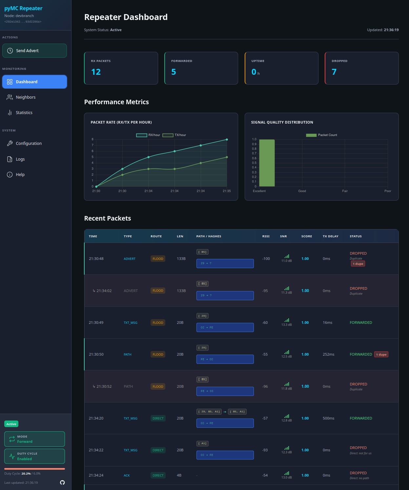

# pyMC_repeater

Repeater Daemon in Python using the `pymc_core` Lib.

---

I started **pyMC_core** as a way to really get under the skin of **MeshCore** — to see how it ticked and why it behaved the way it did.
After a few late nights of tinkering, testing, and head-scratching, I shared what I’d learned with the community.
The response was honestly overwhelming — loads of encouragement, great feedback, and a few people asking if I could spin it into a lightweight **repeater daemon** that would run happily on low-power, Pi-class hardware.

That challenge shaped much of what followed:
- I went with a lightweight HTTP server (**CherryPy**) instead of a full-fat framework.
- I stuck with simple polling over WebSockets — it’s more reliable, has fewer dependencies, and is far less resource hungry.
- I kept the architecture focused on being **clear, modular, and hackable** rather than chasing performance numbers.

There’s still plenty of room for this project to grow and improve — but you’ve got to start somewhere!
My hope is that **pyMC_repeater** serves as a solid, approachable foundation that others can learn from, build on, and maybe even have a bit of fun with along the way.

> **I’d love to see these repeaters out in the wild — actually running in real networks and production setups.**
> My own testing so far has been in a very synthetic environment with little to no other users in my area,
> so feedback from real-world deployments would be incredibly valuable!

---

## Overview

The repeater daemon runs continuously as a background process, forwarding LoRa packets using `pymc_core`'s Dispatcher and packet routing.

...

## Screenshots

### Dashboard

*Real-time monitoring dashboard showing packet statistics, neighbor discovery, and system status*

### Statistics

*statistics and performance metrics*

## Installation

**Clone the Repository:**
```bash
git clone https://github.com/rightup/pyMC_Repeater.git
cd pyMC_Repeater
```

**Quick Install:**
```bash
sudo bash deploy.sh
```

This script will:
- Create a dedicated `repeater` service user with hardware access
- Install files to `/opt/pymc_repeater`
- Create configuration directory at `/etc/pymc_repeater`
- Setup log directory at `/var/log/pymc_repeater`
- **Launch interactive radio & hardware configuration wizard**
- Install and enable systemd service

**After Installation:**
```bash
# View live logs
sudo journalctl -u pymc-repeater -f

# Access web dashboard
http://<repeater-ip>:8000
```

**Development Install:**
```bash
pip install -e .
```

## Configuration

The configuration file is created and configured during installation at:
```
/etc/pymc_repeater/config.yaml
```

To reconfigure radio and hardware settings after installation, run:
```bash
sudo bash setup-radio-config.sh /etc/pymc_repeater
sudo systemctl restart pymc-repeater
```


## Uninstallation

```bash
sudo bash uninstall.sh
```

This script will:
- Stop and disable the systemd service
- Remove the installation directory
- Optionally remove configuration, logs, and user data
- Optionally remove the service user account

The script will prompt you for each optional removal step.


## Roadmap / Planned Features

- [ ] **Public Map Integration** - Submit repeater location and details to public map for discovery
- [ ] **Remote Administration over LoRa** - Manage repeater configuration remotely via LoRa mesh
- [ ] **Trace Request Handling** - Respond to trace/diagnostic requests from mesh network


## Contributing

I welcome contributions! To contribute to pyMC_repeater:

1. **Fork the repository** and clone your fork
2. **Create a feature branch** from the `dev` branch:
   ```bash
   git checkout -b feature/your-feature-name dev
   ```
3. **Make your changes** and test with **real** hardware
4. **Commit with clear messages**:
   ```bash
   git commit -m "feat: description of changes"
   ```
5. **Push to your fork** and submit a **Pull Request to the `dev` branch**
   - Include a clear description of the changes
   - Reference any related issues

### Development Setup

```bash
# Install in development mode with dev tools (black, pytest, isort, mypy, etc)
pip install -e ".[dev]"

# Setup pre-commit hooks for code quality
pip install pre-commit
pre-commit install

# Manually run pre-commit checks on all files
pre-commit run --all-files
```

**Note:** Hardware support (LoRa radio drivers) is included in the base installation automatically via `pymc_core[hardware]`.

Pre-commit hooks will automatically:
- Format code with Black
- Sort imports with isort
- Lint with flake8
- Fix trailing whitespace and other file issues


## Support

- [Core Lib Documentation](https://rightup.github.io/pyMC_core/)
- [Meshcore Discord](https://discord.gg/fThwBrRc3Q)


## License

This project is licensed under the MIT License - see the LICENSE file for details.
